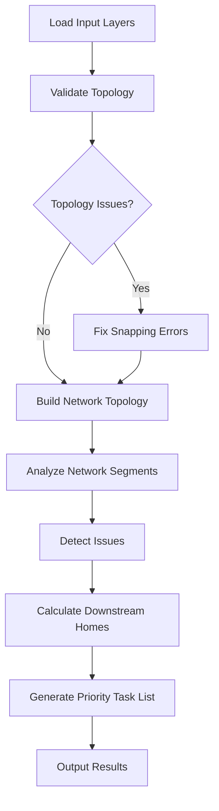

# Downstream Homes Network Analyzer (FME Workbench)

This FME Workbench calculates the number of downstream homes connected at every segment in a utility/fiber network. It first checks if input datasets are topologically connected and builds the network topology. If issues are found, it automatically fixes snapping errors before proceeding to analyze downstream homes and critical network points.

## Key Features

- Topology Validation & Correction: Ensures all input network datasets are connected; snaps misaligned features automatically.
- Network Topology Construction: Builds a logical model of the real-world network from line and point data.
- Downstream Home Calculation: Determines the number of homes/premises affected downstream of each network segment.
- Critical Issue Detection: Flags shortages, faults, blockages, and wayleave requirements.
- Priority Task Generation: Helps field deployment teams focus efforts on critical network segments.

## Input Data Layers

- Line Layer: Fiber cable, Ducts, Gas line, Power line
- Point Layer: Splice closure, Chamber, Water inlet
- Main Start Point: The origin/root of the network
- Premises Layer: Locations of homes/premises to be analyzed

## Visual Workflow

Actual FME WB

## How It Works

1. Load Input Layers: Import line, point, main start, and premises data into FME.
2. Topology Validation: Check network for disconnected segments and misaligned points.
3. Snapping Correction: Automatically adjust features to ensure proper connections.
4. Build Network Topology: Construct logical network from corrected inputs.
5. Segment Analysis: For each network segment, detect issues and calculate downstream homes.
6. Task Prioritization: Rank critical network segments by affected homes/premises.
7. Export Results: Output a prioritized task list for deployment teams.

## Usage

1. Open the workspace in FME Desktop.
2. Load your data layers (line, point, premises, start point).
3. Run the workspace.
4. Review the output file for prioritized tasks and affected homes.

## Contact & Credits

Created by Era Elmido.  
Questions/support: [elmido13@gmail.com]

